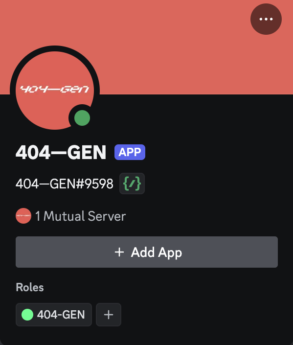
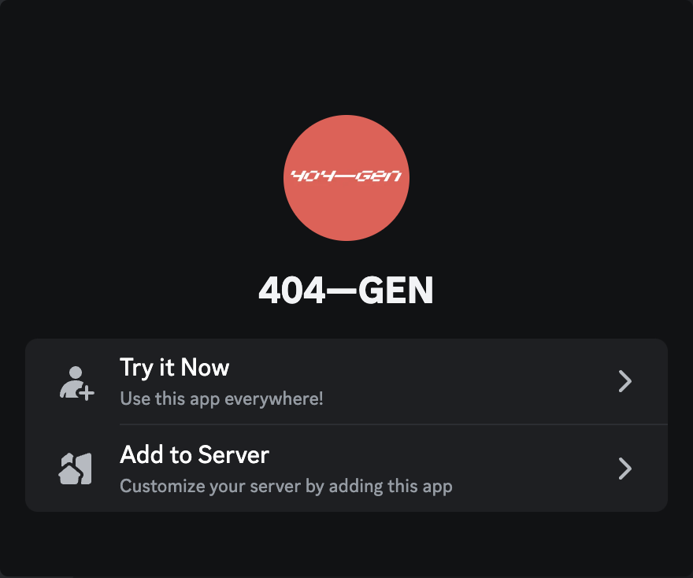

# Discord Bot

You can access the 404—GEN bot in the 404—GEN Discord server or by inviting the bot to any server in which you have **Manage Server** permissions.

## Joining the 404—GEN Discord Server

### 1. Log in to Discord

In order to join the 404—GEN Discord server, you must have a **verified** Discord account.

[Create a Discord Account](https://support.discord.com/hc/en-us/articles/360033931551-Getting-Started)

[Verify a Discord Account](https://support.discord.com/hc/en-us/articles/6181726888215-Verification-Required-FAQ)

### 2. Join the 404—GEN Server on Discord

While logged in to Discord, click the [404—GEN server invite](https://discord.gg/404gen) or paste the following URL into your browser:

> https://discord.gg/404gen

After joining, you will be required to complete a CAPTCHA in order to access all the channels within the server.

### 3. Go to the `#🧪|404-gen` channel

After joining the server, you will see several channels listed in the left sidebar, including:

* `#📢|broadcasts`: Announcements
* `#💻|database`: Official links
* `#🧪|404-gen`: The bot channel
* `#❓|help-forum`: Support and assistance

## Add to Your Server

### 1. Add the App

If you are already a member of a server with the 404—GEN bot, click on the bot's username then click the Add App button.

<figure><figcaption></figcaption></figure>

Alternatively, you can click this [install link](https://discord.com/oauth2/authorize?client\_id=1276096112280866858) or paste the following URL into your browser:

> https://discord.com/oauth2/authorize?client\_id=1276096112280866858

### 2. Make Your Selection

Choose Try it Now to add the bot to your Authorized Apps or Add to Server to add the bot to any server in which you have **Manage Server** permissions.

<figure><figcaption></figcaption></figure>

### 3. Authorize the Bot

The bot needs your permission to create commands.

You should now see the 404—GEN Bot in your Authorized Apps or Server Integrations.

### 4. Use the `/generate` command

After you type /generate into a Discord server with the bot and a `prompt` box will appear. Type your prompt into the box and send the message.

The bot will return a .PLY file and .gif preview of the 3D file
